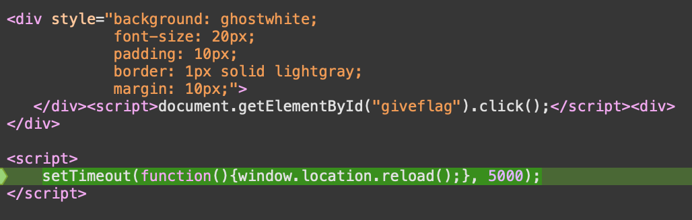

# DESAFIO 1

Ao fazer um pedido na plataforma, ele é avaliado pelo administrador e é retornado, na grande maioria das vezes, um "Mark as read", sem que a flag seja devolvida. Para o contonar, foi possível utilizar cross-site scripting. Respondendo ao formulário com o código do print em baixo foi possível identificar o getElementById() com o ID do botão que nos dá a flag e com o click() foi possível acionar essa ação, fazendo com que o administrador nos desse a flag.

# DESAFIO 2
