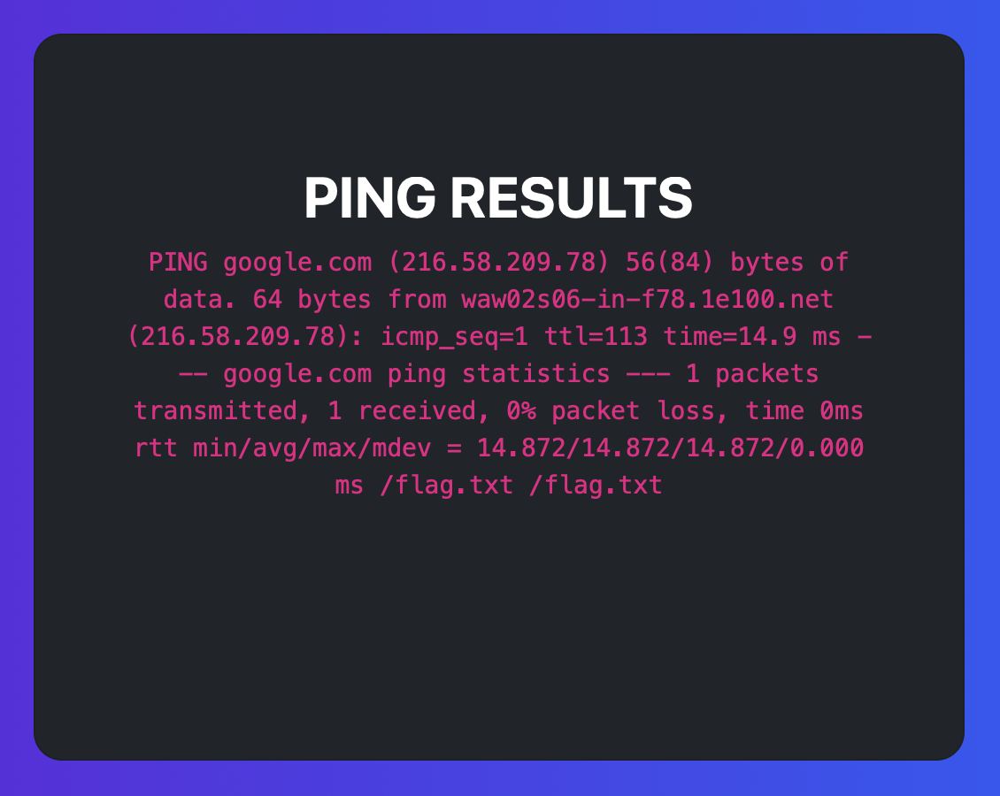
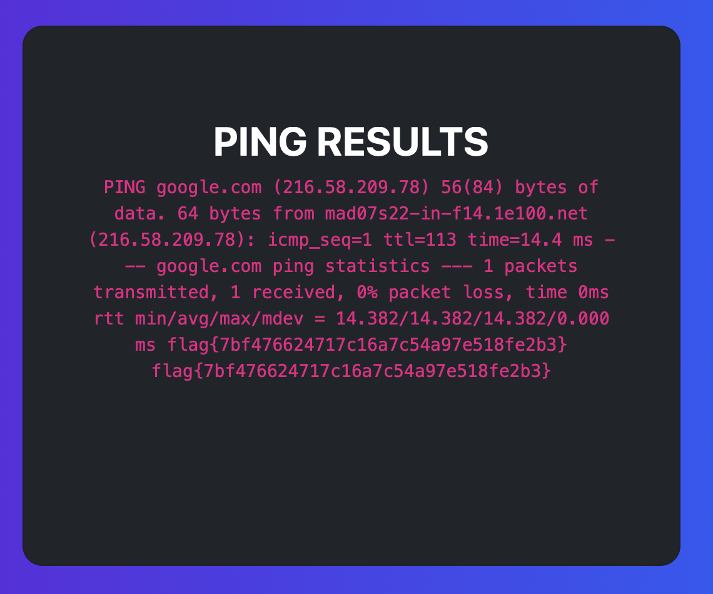

# DESAFIO 1

Neste website, apenas nos é fornecido um campo para login, com username e password, que gostávamos de ultrapassar para conhecer a flag. Olhando para a aula teórica sobre ataques web, uma das vulnerabilidades que presumivelmente se adequava a este problema era a vulnerabilidade de SQL Injection, permitindo fazer bypass ao login sem conhecer as credenciais.

Olhando depois para o código fonte (linha 40), pudemos confirmar a existência desta vulnerabilidade, ou seja, há a possibilidade de alterarmos a semântica do comando SQL construído dinamicamente com base no utilizador e password fornecidos. 

Uma vez que queremos efetuar login como admin podemos colocar admin no campo do utilizador. No campo da palavra-passe é onde faremos a injection, usando para isso a string **"' OR 1=1 OR '"** que faz com que o campo seja sempre verificado (uma vez que 1 é sempre igual a 1). Assim, fomos capazes de fazer login como admin e de obter a flag em causa.

# DESAFIO 2

Neste desafio, sem estar autenticado, um utilizador consegue encontrar duas funcionalidades: o speedreport, que apenas faz display de um parágrafo e de um GIF, ou o PING A HOST, que dá ping num qualquer site que o utilizador introduza no campo para o efeito. Depois de carregar em Ping It, o utilizador é redirecionado para uma outra página onde encontra o resultado dessa ação (do ping).

Esta funcionalidade linux corre num terminal de um servidor portanto a estratégia que utilizamos foi fazer uso do acesso a esse terminal para encontrar a flag: forneciamos o site que era para dar ping e, de seguida, tentávamos ler a flag. Em linux, podemos fornecer várias instruções de uma vez no terminal separando-as com um ponto e vírgula.

O primeiro passo foi encontrar a flag. Para isso, corremos o código **-c 1 google.com; find / -name "flag.txt"** que faz ping uma única vez do site google.com e que, de seguida, corre o comando find que procura em todo o sistema o ficheiro com o nome flag.txt. Assim, obtemos a seguinte resposta:

Com este resultado, ficamos a saber que o ficheiro flag.txt se encontra no diretório principal, podendo assim aplicar um "cd /" para irmos para esse diretório. Depois de aí nos encontrarmos, podemos correr o comando **cat flag.txt** que lê o ficheiro flag.txt.

Assim, num segundo passo, fornecemos ao sistema o código **-c 1 google.com; cd /; cat flag.txt** que nos retorna a flag, conforme imagem abaixo:

