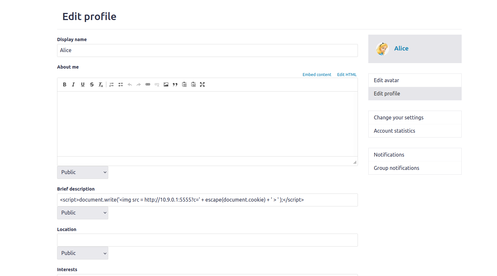

# Tarefa1

Para a primeira tarefa começamos por entrar na conta do suposto atacante que neste caso foi a Alice. 
Depois de entrarmos no perfil da Alice colocámos o seguinte 
javascript na breve descrição 

Experimentando entrar com outro user podemos verificar que ao carregar no perfil da Alice aparece a mensagem desejada pelo atacante 

# Tarefa2 

Nesta tarefa o objetivo é incorporar um javascript de forma a que quando visitem o perfil da Alice apareçam os cookies do usuário sendo estes exibidos na janela de alerta.
Para isso utilizamos a seguinte linha de codigo no campo "About Me" do edit profile editamos o html com o script dado:

Conseguimos verificar que , fazendo login por exemplo como boby e clicando no perfil da Alice irá aparecer um janela com os "cookies".

# Tarefa3 

Nesta tarefa ao contrario da anterior o objetivo é que  o código JavaScript envie os cookies para o atacante. Para conseguir isso, escolhemos um campo do perfil da Alice e introduzimos o código JavaScript malicioso dado.

Este script insere uma imagem com o atributo src apontar para a maquina do atacante.

Utilizamos o seguinte comando para recebermos as cookies do utilizador que envia os cookies para a porta 5555 da maquina do atacante com o ip 10.9.0.1.

Depois de editar o html com o script dado, observamos que recebemos a cookie da vitima do atacante, 

# Tarefa4

Nesta tarefa, pretendemos descobrir quais informações são enviadas na solicitação HTTP enviada quando um utilizador adiciona a Alice(Atacante) como amigo no site da Elgg.

Com outro utilizador, faço login(neste caso o boby) e adiciono como amigo a Alice, e consigo então verificar que foi mandada uma solicitação "HTTP GET", verificando o url.

 url relativo ao adicionar como amigo:

Agora iremos substituir a variável sendurl por este url. Como The_elgg_ts and _elgg_token não precisam de ser repetidos ficará só deste modo:

Portanto agora iremos por este codigo com o url referente ao adicionar amigo preenchido no "about me"
da Alice.

Assim ,Visitando os amigos da Alice,verificamos que um deles é o boby. Logo foi bem sucedido.

Questão 1: 
 As linhas um e dois obtêm os valores dos parâmetros __elgg_ts e __elgg_token. Este parâmetros mudam sempre que uma página é carregada e, portanto precisam de ser acessadas dinamicamente pelo "Cross Site Scripting" para obter os valores corretos.
 
Questão 2:
 Não, se o Elgg fornecesse apenas o "About me" para editar, o ataque não iria ser bem-sucedido. Isto porque o modo de edição adiciona HTML extra e altera alguns dos símbolos.
 
  
 

