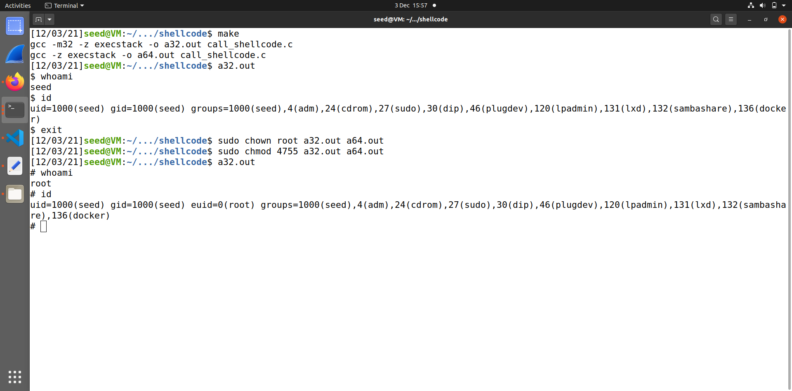

# tarefa 1

Depois de considerarmos o código utilizamos o makefile para compilar o programa.

Depois de executarmos o programa verificámos que não tinhamos permissões do root. 

Usámos depois os seguintes comandos para mudarmos a propriedade para root e alteramos a permissao para 4755 

## tarefa 2 

Nesta task utilizámos novamente o make para compilar o programa o qual foram gerados ficheiros a vermelho.
Conseguimos visualizar que os ficheiros a vermelho tem propriedade root e outras permissoes como o x e o s 

## Tarefa 3

Começamos por utilizar os comandos fornecidos pelo guião:

Utilizamos o codigo fornecido do exploit.py e definimos o valor 0x0D5 para o start que é menor que 517 para evitar o Segmentation fault.

De seguida para calcular o offset fizemos a diferença entre ebp(0xffffc938) e o buffer(0xffffc8cc). Como a stack está implementada em 32 bits somamos 4bytes. 
Offset = ebp - buffer + 4 = 108

ret = 0xffffc8cc + 0xD5

No final corremos os comandos:
python3 exploit.py 
./stack-L1 
