# Tarefa 1

Começamos por mudar o URL do aplicativo Web no ficheiro etc/hosts 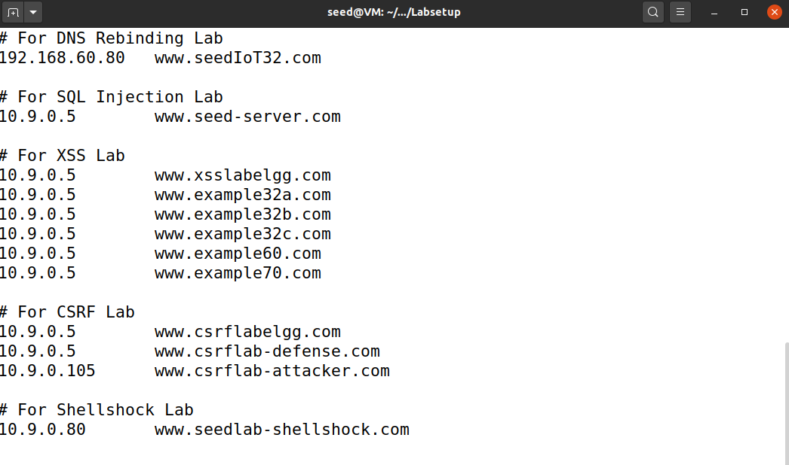

De seguida corremos os comandos dcbuild e dcup
Com o comando dockps obtemos o ID do container e com o docksh acedemos ao pretendido mysql 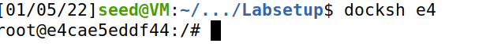

Depois de usarmos os comandos para podermos usar a database e ver os credenciais da mesma, obtemos os dados da Alice usando o seguinte comando: 
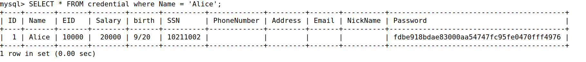

# Tarefa 2.1

Nesta tarefa o objetivo é autenticarmo-nos como administrador sabendo apenas o nome do utilizador. 
A vulnerabilidade está no facto de o programa nao verificar o input do nome do utilizador. Verifica apenas se a password está correta

A ideia consiste em usar o nome do utilizador (Admin) seguido de uma aspa e dois ifens e um espaço ou um (#)

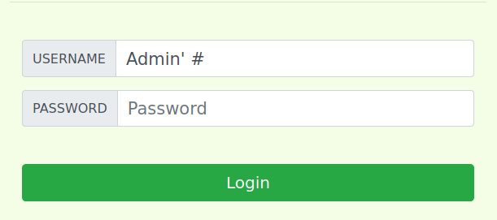

# tarefa 2.2

Esta tarefa é a mesma so que desta vez fazemos o ataque atraves do curl. 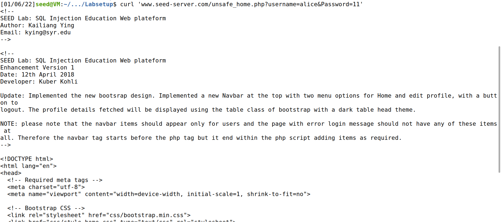

Nesta tarefa não podemos usar os carateres '-- ou '# pois não são reconhecidos. Para isso é necessario codificar estes carateres para codigo ASCII

Neste caso os nossos carateres em ASCII seriam:
' -> %27
space -> %20
(#) -> %23

Ficariamos então com o seguinte curl: 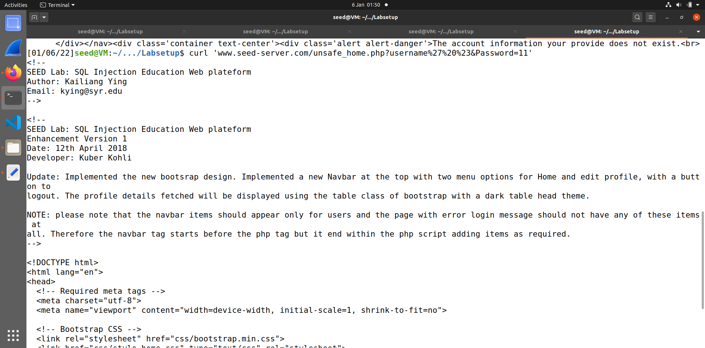

# tarefa 2.3

O intuito desta tarefa é o mesmo que nas outras mas desta vez usar outras instruçoes de sql como o update ou o delete.
Tentamos efetuar uma alteraçao no username Admin com a seguinte instrução:
admin' ; UPDATE credential SET Name = 'Boss' WHERE Name = 'Admin';#

Obtivemos um erro de sintax no servidor pois a instruçao resulta em dois comandos SQL e a versao de PHP não permite fazer multiplas Querys

# tarefa 3.1

 Temos como objetivo nesta tarefa aumentar o salário de o empregado que fizer login sem autorização  do chefe.
 Neste caso assumimos o empregado sendo a Alice, portanto autenticamo nos como Alice.
 
 Para isso fazemos o que está dentro de aspas "',salary = 9999999 where EID = 10000;#" no NickName 
 da página de edição do perfil do empregado(Alice).
 
 Neste exemplo estamos a aumentar o salário da Alice para 9999999.
 
 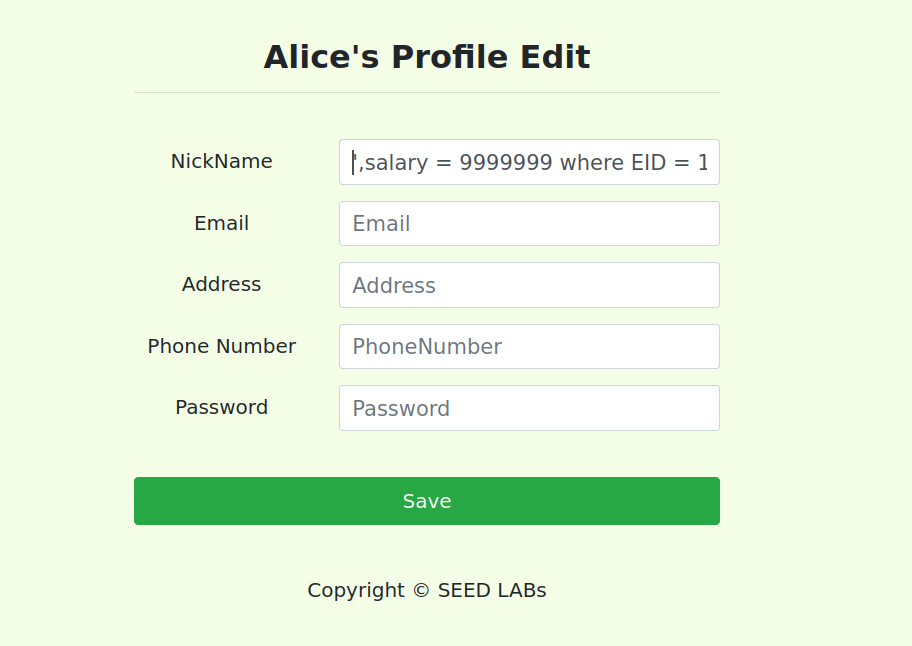
 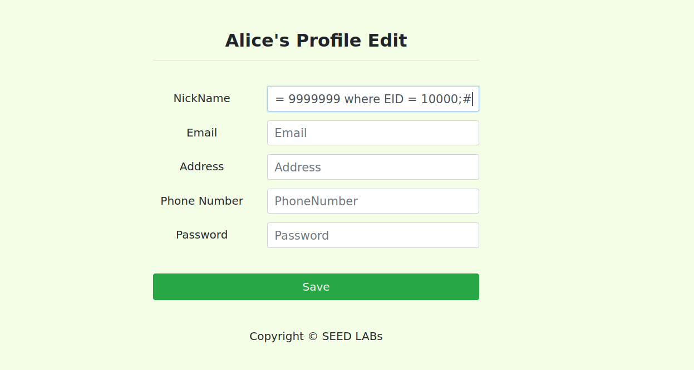
 
# tarefa 3.2

 Temos agora como objetivo diminuir o salário de outra pessoa, neste caso, o Boby para 1.
 Neste caso vamos diminiur a partir do perfil da Alice.
 
 Para isso fazemos o que está dentro de aspas"',salary = 1 where Name = "Boby";#" no NickName
 da página de edição do perfil do empregado(Alice). 
 
  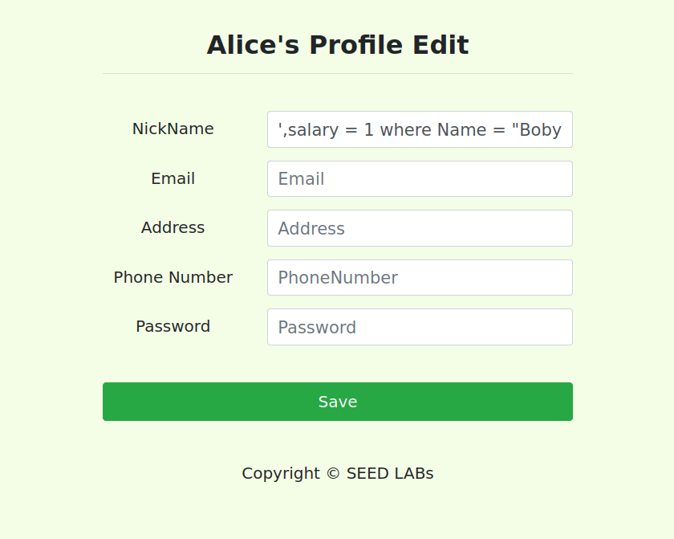
  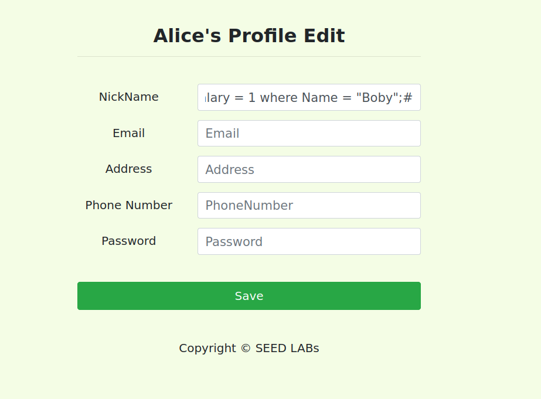
  
 Conseguimos verificar a alteração entrando como administrador por exemplo.
 
 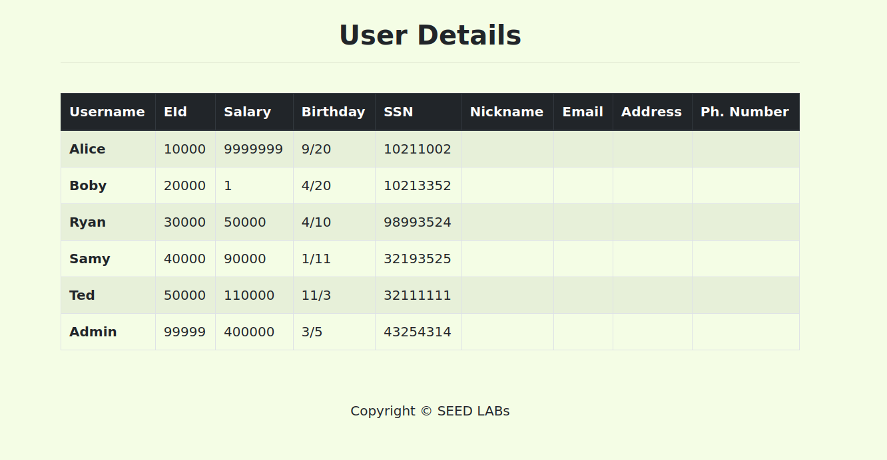 

# tarefa 3.3

 Temos agora como objetivo mudar a password do chefe(Boby) sendo um empregado.
 
 Primeiro queremos definir a password que queremos usar, e sabendo que queremos mudar as passwords através dos hashs então iremos ver qual a hash que representa a password que escolheremos, através do sha1.
 
 sha1 -> retorna a hash de 40 carateres de uma string.
 
 Neste caso, vamos escolher a password "hacked".

 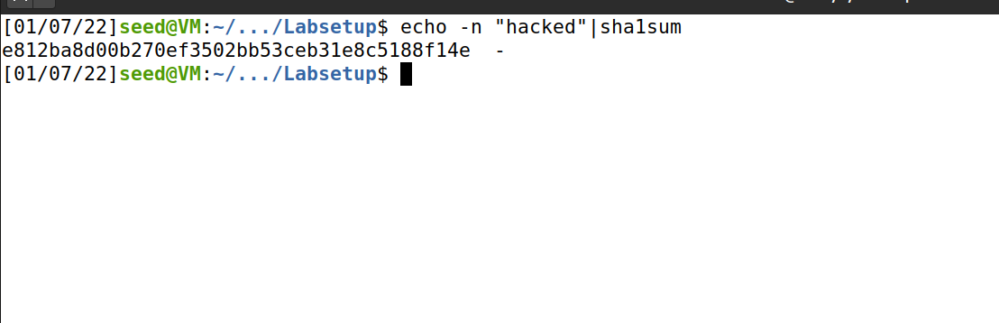
 
   Agora fazemos o que está dentro de aspas"'password='e812ba8d00b270ef3502bb53ceb31e8c5188f14e' where name='Boby';#" no NickName
 da página de edição do perfil do empregado(Alice), substituindo a password pela hash retornada.

 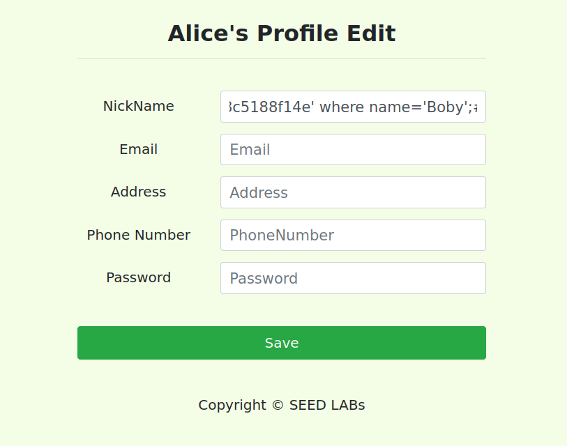
 

