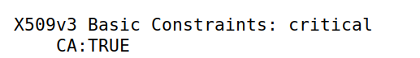
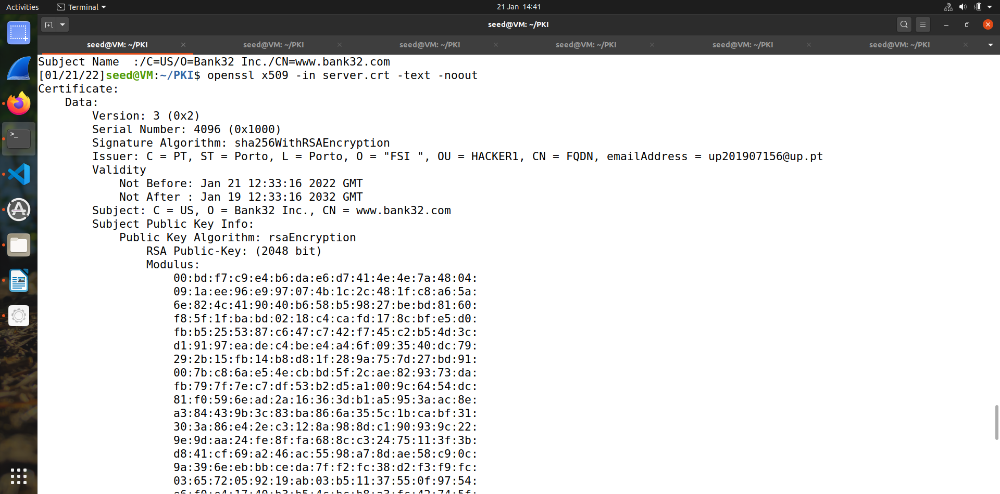

# Tarefa 1

Nesta tarefa geramos um certificado autoassinado , ou seja uma entidade confiável que emite certificados digitais. 

1)Parte do certificado que garante que este é um certificado CA:  
 

2)Trata-se de um certificado autoassinado, uma vez que o Subject é igual ao Issuer:

3) No RSA Algorithm temos um expoente publico e;   
um expoente privado d; ![fig4] (4.png) 
modulus n; 
p -> prime1 
q -> prime2 

# Tarefa 2

Nesta tarefa pretende-se gerar um CSR, este será gerado então pelo CA criado correndo o seguinte comando: 

Corremos de seguida o seguinte comando para podermos permitir ter nomes alternativos 

# Tarefa 3

Primeiramente transformamos a solicitação de assinatura de certificado em um certificado X509 usando o seguinte comando: 

Depois descomentamos o "copy_extensions" do ficheiro openssl.cnf e de seguida usamos o seguinte comando para imprimir o conteudo descodificado do certificado:

